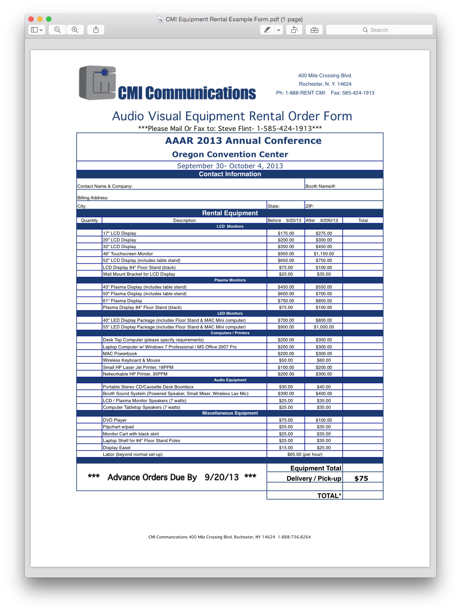
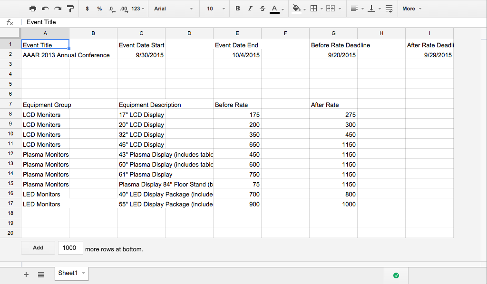

# CMI Orders

This builds out a sample of the form generater.
Excel > CSV > JSON > HTML/CSS/JS

We are making a digital version of this:


Starting with this:



## Setup

We're using Python to process the CSV into JSON. We're using Grunt to build the
front-end.

To build the demo
```
$ mkvirtualenv venv  # make a python virtual environment, i like virtualenvwrapper
(venv)$ pwd
~/cmi-orders
(venv)$ python src/utils/cmi-csv-import.py  # create our json data
(venv)$ cd src/
(venv)$ npm install
(venv)$ grunt  # this will create the build/ dir at the root
(venv)$ cd ../build
(venv)$ python -m simpleHTTPServer 8080  # view at 127.0.0.0:8080
```

To use your own data, just add the files to the data/ folder and update config.py
in src/utils/


### Front-End Stack
moment.js
handlebars.js
